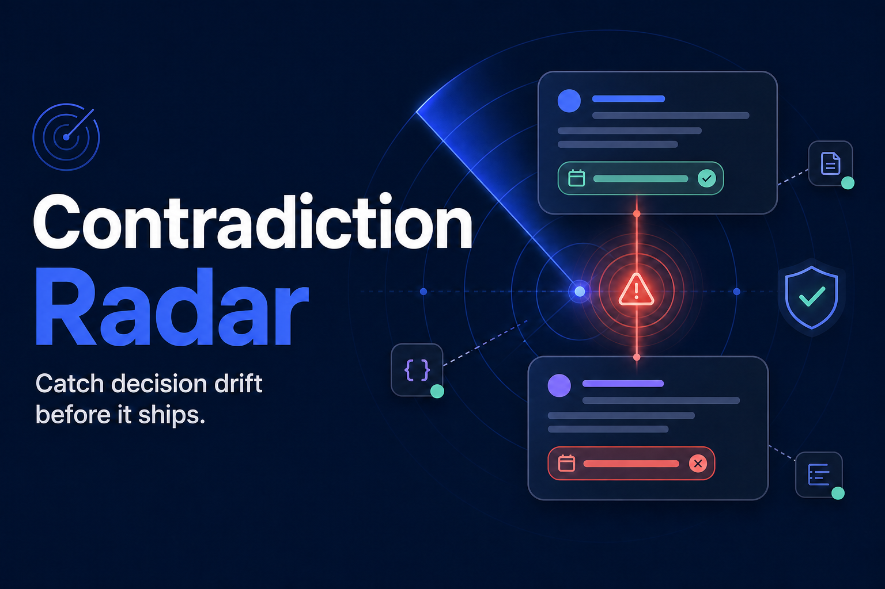
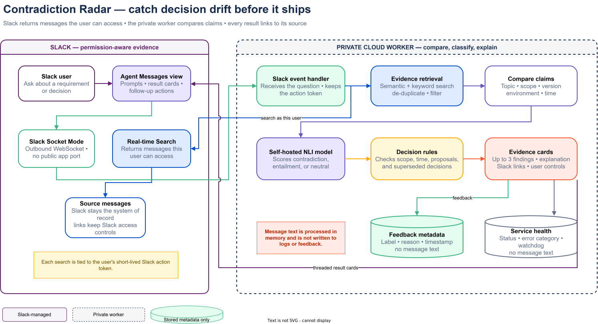

# Contradiction Radar

**Catch decision drift before it ships.** Contradiction Radar checks a current requirement or decision against earlier Slack evidence, explains likely conflicts conservatively, and shows its receipts.

It is built for the **New Slack Agent** track of the 2026 Slack Agent Builder Challenge.



## Why it exists

Work rarely breaks because nobody documented a decision. It breaks because the decision changed three weeks later—and the old version still sounds just as confident in Slack. Keyword search finds similar words; Contradiction Radar looks for incompatible claims and links back to the exact evidence behind its reasoning.

The agent deliberately prefers precision over recall. It distinguishes direct contradictions, requirement conflicts, superseded decisions, scope mismatches, time mismatches, and proposals that still need clarification. Results are decision support—not a verdict.

## Slack-native flow

1. DM the agent: `Check this claim: Project Atlas must launch on September 15.`
2. Slack's Real-time Search API returns only evidence available in the triggering user's context.
3. A self-hosted quantized NLI model scores each pair; deterministic policy checks scope, time, version, environment, proposal status, and supersession.
4. The agent returns up to three Block Kit evidence cards with Slack permalinks.
5. **Add context**, **Mark resolved**, or **False positive** keeps the user in control. Added context triggers a fresh classification.

## Architecture and privacy



- Current Slack `agent_view` messaging experience with suggested prompts and threaded replies.
- Bolt for JavaScript over Socket Mode; no public inbound endpoint.
- User-triggered `assistant.search.context` calls include the event `action_token`.
- Self-hosted `Xenova/nli-deberta-v3-xsmall` ONNX inference via Transformers.js; no message content is sent to a remote model API.
- Raw Slack message bodies are never persisted. Findings selected for the interactive **Add context** flow stay only in a bounded, single-use in-memory cache for at most ten minutes.
- Logs are body-free. Feedback stores identifiers, labels, reason codes, and timestamps only.
- Slack permalinks preserve Slack's access boundary instead of copying findings into channels.

See [architecture](docs/architecture.md) and [security/privacy](docs/security-privacy.md) for the full design.

## Requirements

- Linux for the production systemd deployment, or Windows 10/11 for the fallback service scripts
- Node.js 24+
- npm 11+
- Slack CLI 4.4.0+
- A Slack developer sandbox with AI search enabled

## Set up

```powershell
git clone https://github.com/ArabesE/contradiction-radar.git
cd contradiction-radar
npm ci
Copy-Item .env.example .env.local
```

Create a Slack app from `manifest.json`, enable Socket Mode, generate an app-level token with `connections:write`, install the app to the intended workspace, then put its values in `.env.local`. Never commit that file.

```dotenv
SLACK_BOT_TOKEN=xoxb-...
SLACK_APP_TOKEN=xapp-...
SLACK_TEAM_ID=T...
```

The first run downloads the pinned quantized model revision. Build, start, and verify:

```powershell
npm run check
npm run service:start
npm run health
```

For automatic startup at Windows logon:

```powershell
npm run service:install
```

Use `npm run restart` after code/config changes. Runtime logs and the PID live under ignored `data/runtime/`.

The judging deployment runs on a private Linux VM with no inbound application port, automatic boot startup, process restart, and a five-minute Slack health watchdog. See [cloud deployment](docs/cloud-deployment.md). The Windows task is retained only as an emergency fallback and is disabled after cloud cutover.

## Test and evaluation evidence

```powershell
npm run check
npm run evaluate
npm run preflight
```

Current results on the fixed, hand-authored 28-pair fixture:

- 28/28 automated tests passing
- 28/28 exact classification labels
- 100% precision among pairs predicted as direct/requirement conflicts
- 0 deterministic fallback cases

This is a small regression fixture designed to cover product behaviors; it is not an independent real-world accuracy benchmark. See [testing](docs/testing.md) for methodology and limitations.

## Demo prompts

```text
Check this claim: Project Atlas must launch on September 15.
Check this claim: SSO must be enabled for every account.
```

The sandbox includes six clearly labeled `[DEMO DATA]` messages that demonstrate requirement conflict, supersession, proposal-vs-decision, and production/version scope handling.

## Project map

- `src/slack/` — permission-aware retrieval, Block Kit, body-free feedback
- `src/domain/` — claim/marker preprocessing and conservative decision policy
- `src/nli/` — pinned local NLI inference and deterministic fallback
- `tests/fixtures/evaluation.json` — fixed 28-pair evaluation set
- `scripts/` — health, evaluation, Linux/Windows service, scheduler, and preflight operations
- `docs/` — product, architecture, security, judge, demo, and submission artifacts

## Model and source licenses

Application code is MIT licensed. The NLI model is the Transformers.js conversion of `cross-encoder/nli-deberta-v3-xsmall`; the upstream model card declares Apache-2.0. The exact conversion revision is pinned in `.env.example`.

## References

- [Slack Agent messaging experience](https://docs.slack.dev/changelog/2026/06/30/agent-messages-tab/)
- [Slack Real-time Search API](https://docs.slack.dev/apis/web-api/real-time-search-api/)
- [`assistant.search.context`](https://docs.slack.dev/reference/methods/assistant.search.context/)
- [Upstream NLI model card](https://huggingface.co/cross-encoder/nli-deberta-v3-xsmall)
